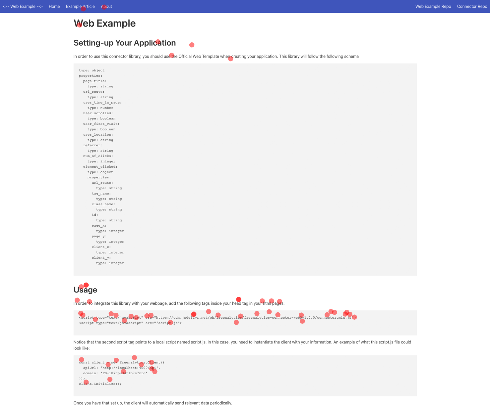
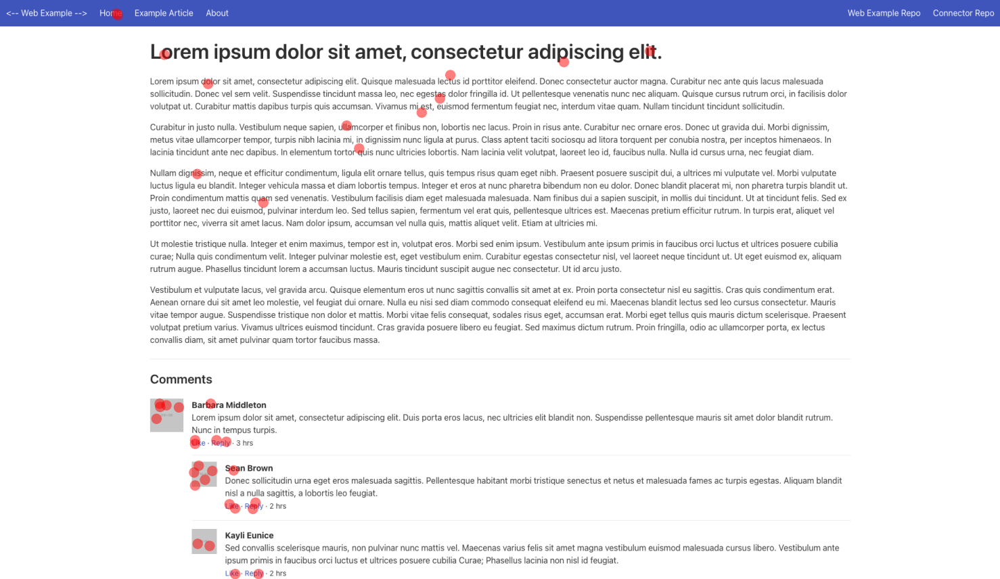
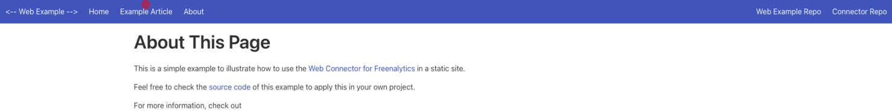

# Page Clicks View

The script [tools-page-clicks-view](https://github.com/freenalytics/tools-page-clicks-view) is a little script that can generate
a screenshot of a website and add some circles of where the users have clicked.

The script was made with the [Official Web Template](../official-templates/web-template.md) in mind and it is by no means a generic
solution since it was made for the [Webpage Example](../examples/webpage-example.md).

A guide on how to update the script is inside the repository's [README](https://github.com/freenalytics/tools-page-clicks-view#readme).

## Implementation

The implementation logic is pretty simple and it goes something like this:

### Taking a Screenshot

We can use something like [Selenium](https://www.selenium.dev/) to get a screenshot of the webpage.

```py
def screenshot_page(url: str, screenshot_destination: str, **kwargs):
  force_width = kwargs.get('width')
  force_height = kwargs.get('height')

  driver = webdriver.Chrome(options=options)
  driver.get(url)

  width, height = get_page_dimensions(driver)
  driver.set_window_size(force_width or width, force_height or height)
  
  driver.find_element(By.TAG_NAME, 'body').screenshot(screenshot_destination)
  driver.quit()
```

### Get the Page Click Coordinates

We then parse the exported CSV to get all the clicks on a specific page, we get the coordinates and then normalize them
with the user's page size.

```py
def get_page_click_normal_coordinates(csv_data: str, route_filter: str) -> np.array:
  df = pd.read_csv(csv_data)
  filtered_df = df.loc[df['element_clicked.url_route'] == route_filter]

  page_x = filtered_df['element_clicked.page_x'].to_numpy()
  page_width = filtered_df['element_clicked.page_width'].to_numpy()
  page_y = filtered_df['element_clicked.page_y'].to_numpy()
  page_height = filtered_df['element_clicked.page_height'].to_numpy()

  normal_x = page_x / page_width
  normal_y = page_y / page_height

  return np.array(list(zip(normal_x, normal_y)))
```

### Apply Circles Where Users Have Clicked

We can then treat the screenshot taken previously and add circles where all the users have clicked on the page:

```py
def overlay_page_clicks(raw_screenshot_path: str, normal_coordinates: np.array, output_path: str, **kwargs):
  radius = kwargs.get('radius') or DEFAULT_CIRCLE_RADIUS
  color = kwargs.get('color') or DEFAULT_COLOR
  alpha = kwargs.get('alpha') or DEFAULT_ALPHA

  img = plt.imread(raw_screenshot_path)
  img_width = img.shape[1]
  img_height = img.shape[0]
  px = 1 / plt.rcParams['figure.dpi']

  fig, ax = plt.subplots(figsize=(img_width * px, img_height * px))
  ax.set_aspect('equal')

  for page_x, page_y in normal_coordinates:
    x = page_x * img_width
    y = page_y * img_height

    circle = Circle((x, y), radius, facecolor=color, alpha=alpha)
    ax.add_patch(circle)

  ax.imshow(img)
  plt.axis('off')
  plt.savefig(output_path, bbox_inches='tight', pad_inches=0)
```

And that's it. We have now generated images to see where users have clicked.

Further improvement of this script could include:

* Make it generic and automatize it.
* Instead of using circles to display user clicks, draw a heatmap over the page screenshot.

## Results

Check out the results of running this script:

<figure markdown>
  
  <figcaption>Example Home page.</figcaption>
</figure>

<figure markdown>
  
  <figcaption>Example article page.</figcaption>
</figure>

<figure markdown>
  
  <figcaption>Example about page.</figcaption>
</figure>
