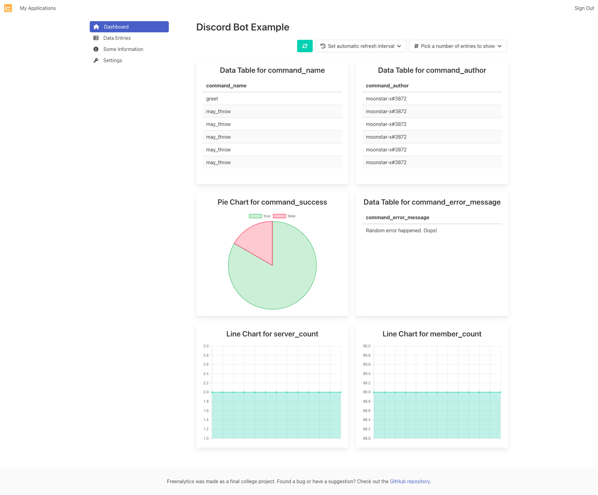

# Discord Bot Example

The [freenalytics/example-discord-bot](https://github.com/freenalytics/example-discord-bot) repository includes a small bot for [Discord](https://discord.com/) that contains
two simple commands that greet the user and that makes the command run into an error with an 80% chance.

There is no official template for Discord bots, however, the Freenalytics application that was created uses the following schema:

```yaml
type: object
properties:
  command_name:
    type: string
  command_author:
    type: string
  command_success:
    type: boolean
  command_error_message:
    type: string
  server_count:
    type: integer
  member_count:
    type: integer
```

The bot will then keep track of the name of the command that was issued, the username of who issued the command, whether it was successful,
and if not, the error of the command. Additionally, it records the number of servers and users with access to the bot every 10 seconds.

## Client Implementation

In case you're curious, here's the implementation of the client that communicates with Freenalytics.

<script src="https://emgithub.com/embed.js?target=https%3A%2F%2Fgithub.com%2Ffreenalytics%2Fexample-discord-bot%2Fblob%2Fmaster%2Fsrc%2Fthird-party%2Ffreenalytics%2FFreenalyticsClient.js&style=github-gist&showBorder=on&showLineNumbers=on&showFileMeta=on&showCopy=on&fetchFromJsDelivr=on"></script>

## Dashboard Screenshot

The Dashboard that you can expect to see is:


