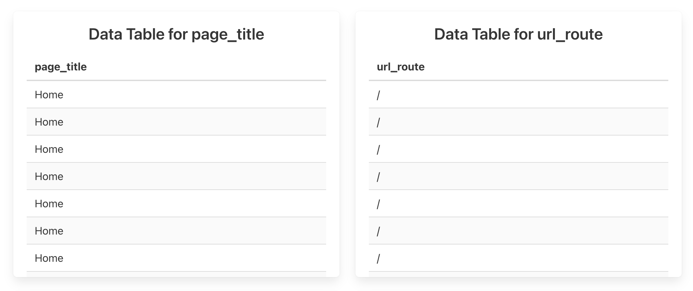
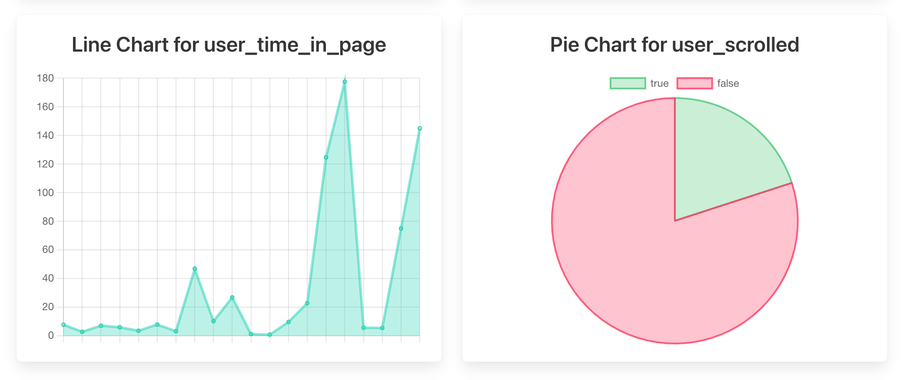
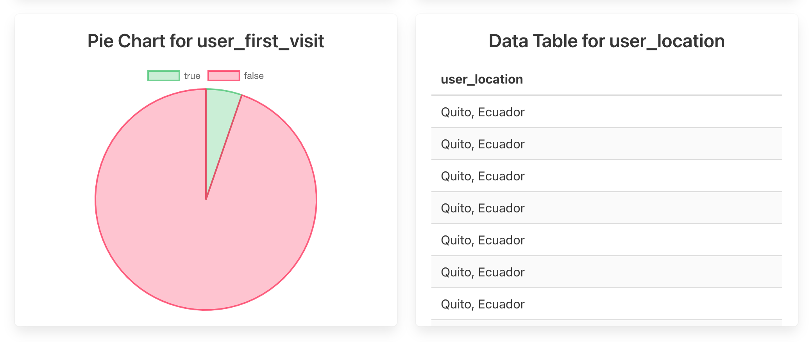
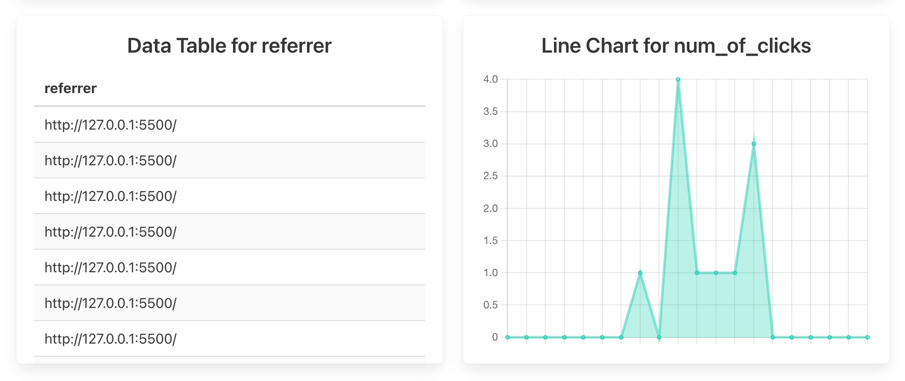
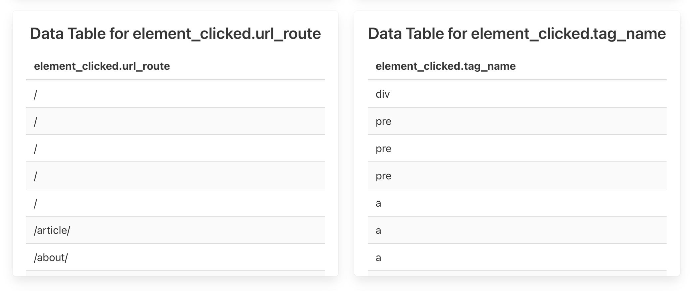
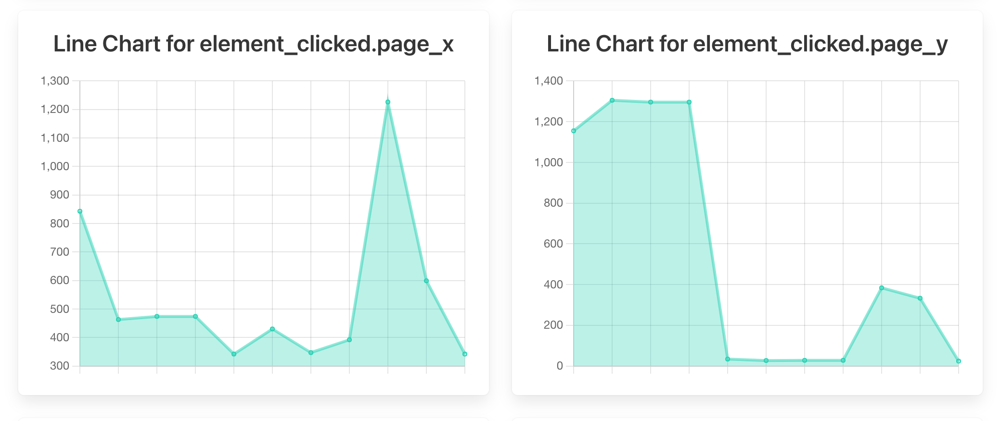
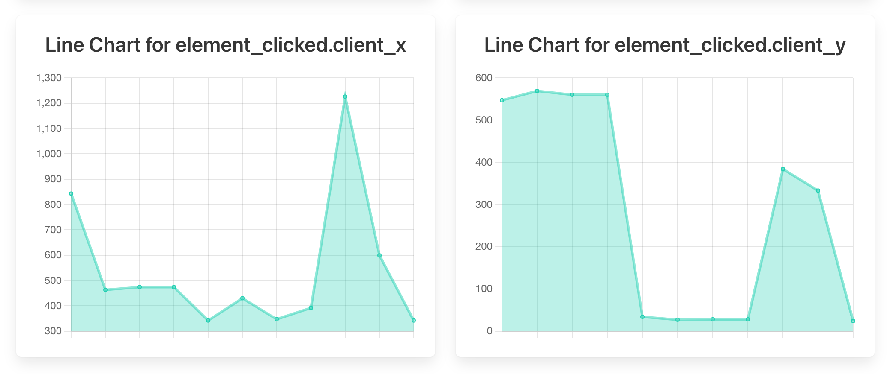

# Webpage Example

The [freenalytics/example-web](https://github.com/freenalytics/example-web) repository includes a small website that displays
a fake article.

The website makes use of the [Official Web Template](../official-templates/web-template.md) and uploads some basic information
of the current's user interactions, such as element clicks, referral sites, current routes, whether a scroll event has been
fired, and so on.

## Graph Screenshots

Some graphs that you can expect to see include:

