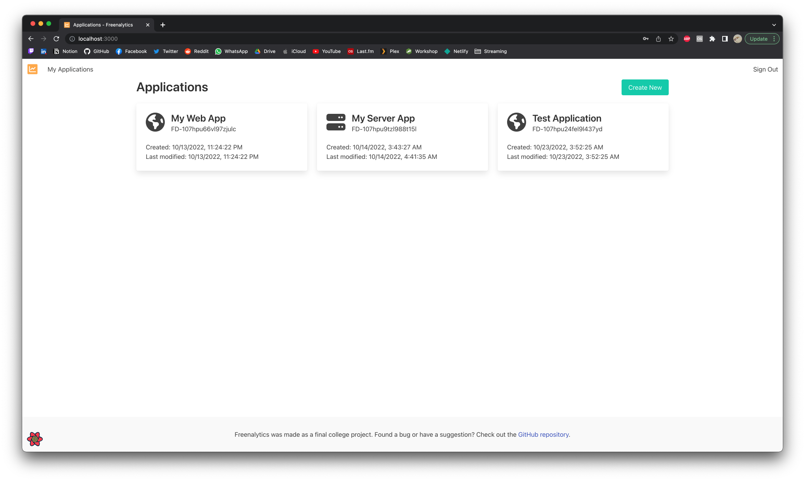
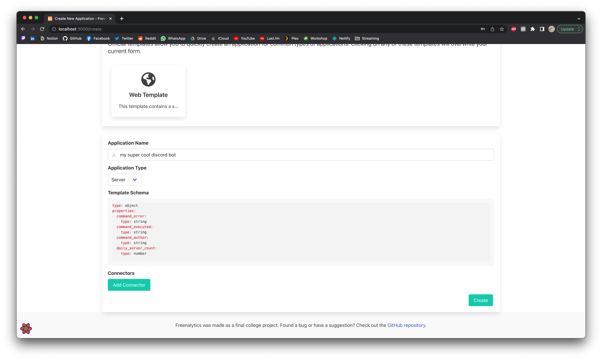

# Creating your First Application

## Creating an Application

First, login to your web dashboard and inside the main page, click in `Create New`.



Inside the application form, fill out the required fields with the information of your application.



The `Template Schema` field should be a valid [JSON Schema](https://json-schema.org/draft/2020-12/json-schema-core.html) which will be used to structure and validate
any incoming data entry. Schemas should be of type `object` at the top level and must include any data fields as properties.

In the case that the structure contains data that is independent from each other you should probably not set those properties as required.

## Example Above

In the example above, the following schema is used:

```yaml
type: object
properties:
    command_error:
        type: string
    command_executed:
        type: string
    command_author:
        type: string
    daily_server_count:
        type: number
```

This example is a basic schema for a [Discord Bot](https://discord.com/developers/docs). In this case each field means the following:

* `command_error`: Whenever a command throws any error, the bot will upload the error message.
* `command_executed`: This contains the name of the command that was executed.
* `command_author`: This contains the name of the user that executed the command.
* `daily_server_count`: This corresponds to the number of servers the bot is in. This value would be updated daily with a cronjob.

In this case, in an ideal workflow, whenever a command is executed by a user, the bot should upload a payload with the following structure:

```json
{
    "command_executed": "my_command",
    "command_author": "username"
}
```

If there is an error, the bot should upload a payload like:

```json
{
    "command_executed": "my_command",
    "command_author": "username",
    "command_error": "Tried to divide by 0."
}
```

And daily on a cronjob basis, the bot could upload a payload like:

```json
{
    "daily_server_count": 42
}
```
