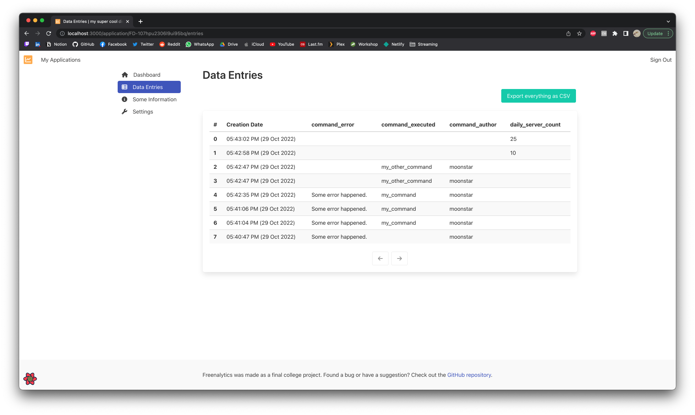
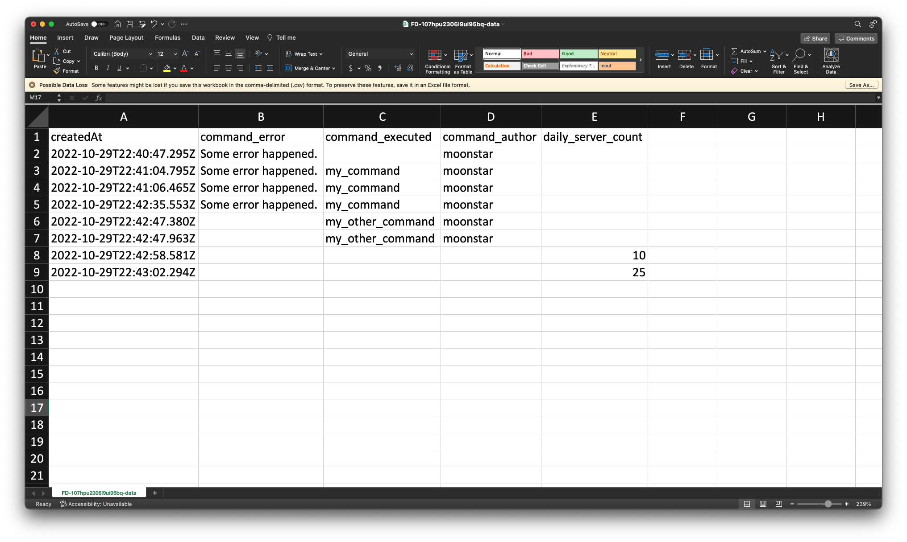

# Exporting Data

Inside your application dashboard, clicking on the `Data Entries` sidebar item will take you to a page that will display
a table with all the data entries that there is for your application.

In case you need export your data entries as a CSV for processing, you can click on the `Export everything as CSV` button
which will download a CSV with everything for this application.

