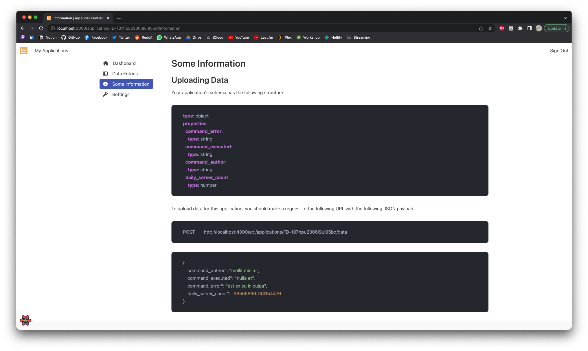

# Uploading Data

## Some Information

Inside your application dashboard, clicking on the `Some Information` sidebar item will take you to a page that will give you
some insight on how to upload data for your application.



This page will remind you of the application schema and will show you the endpoint to upload data with a little example of what
type of data you can upload.

## Example

In the example above, the following schema is used:

```yaml
type: object
properties:
    command_error:
        type: string
    command_executed:
        type: string
    command_author:
        type: string
    daily_server_count:
        type: number
```

And the endpoint is:

```text
POST    http://localhost:4000/api/applications/FD-107hpu2306l9ui95bq/data
```

This example is a basic schema for a [Discord Bot](https://discord.com/developers/docs). In this case each field means the following:

* `command_error`: Whenever a command throws any error, the bot will upload the error message.
* `command_executed`: This contains the name of the command that was executed.
* `command_author`: This contains the name of the user that executed the command.
* `daily_server_count`: This corresponds to the number of servers the bot is in. This value would be updated daily with a cronjob.

In this case, in an ideal workflow, whenever a command is executed by a user, the bot should upload a payload with the following structure:

=== "Curl"
    ```bash
    curl -X POST http://localhost:4000/api/applications/FD-107hpu2306l9ui95bq/data\
        -H 'Content-Type: application/json'\
        -d '{ "command_executed": "my_command", "command_author": "username" }'
    ```

=== "Node.js"
    ```js
    const axios = require('axios');

    axios.post('http://localhost:4000/api/applications/FD-107hpu2306l9ui95bq/data', {
        command_executed: 'my_command',
        command_author: 'username'
    })
        .then((response) => console.log(response.data))
        .catch((error) => console.error(error.response.data));
    ```

=== "Python"
    ```python
    import requests

    payload = {
        'command_executed': 'my_command',
        'command_author': 'username'
    }
    response = requests.post('http://localhost:4000/api/applications/FD-107hpu2306l9ui95bq/data', json=payload)

    print(response)
    ```

If there is an error, the bot should upload a payload like:

=== "Curl"
    ```bash
    curl -X POST http://localhost:4000/api/applications/FD-107hpu2306l9ui95bq/data\
        -H 'Content-Type: application/json'\
        -d '{ "command_executed": "my_command", "command_author": "username", "command_error": "Tried to divide by 0." }'
    ```

=== "Node.js"
    ```js
    const axios = require('axios');

    axios.post('http://localhost:4000/api/applications/FD-107hpu2306l9ui95bq/data', {
        command_executed: 'my_command',
        command_author: 'username',
        command_error: 'Tried to divide by 0.'
    })
        .then((response) => console.log(response.data))
        .catch((error) => console.error(error.response.data));
    ```

=== "Python"
    ```python
    import requests

    payload = {
        'command_executed': 'my_command',
        'command_author': 'username',
        'command_error': 'Tried to divide by 0.'
    }
    response = requests.post('http://localhost:4000/api/applications/FD-107hpu2306l9ui95bq/data', json=payload)

    print(response)
    ```

And daily on a cronjob basis, the bot could upload a payload like:

=== "Curl"
    ```bash
    curl -X POST http://localhost:4000/api/applications/FD-107hpu2306l9ui95bq/data\
        -H 'Content-Type: application/json'\
        -d '{ "daily_server_count": 42 }'
    ```

=== "Node.js"
    ```js
    const axios = require('axios');

    axios.post('http://localhost:4000/api/applications/FD-107hpu2306l9ui95bq/data', {
        daily_server_count: 42
    })
        .then((response) => console.log(response.data))
        .catch((error) => console.error(error.response.data));
    ```

=== "Python"
    ```python
    import requests

    payload = {
        'daily_server_count': 42
    }
    response = requests.post('http://localhost:4000/api/applications/FD-107hpu2306l9ui95bq/data', json=payload)

    print(response)
    ```
