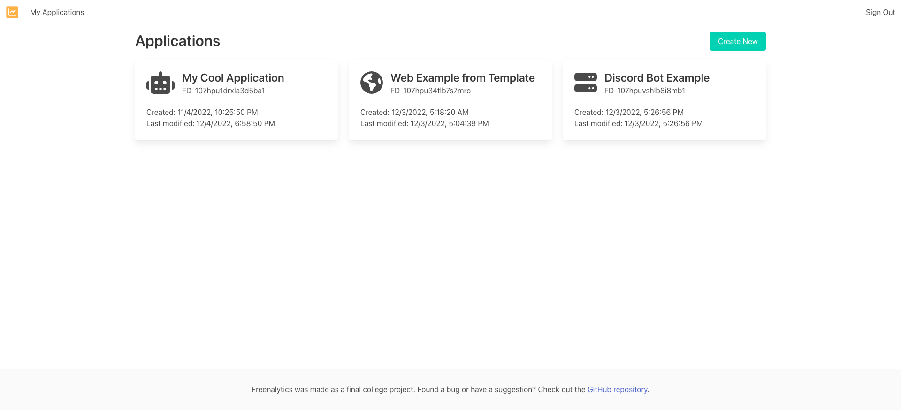
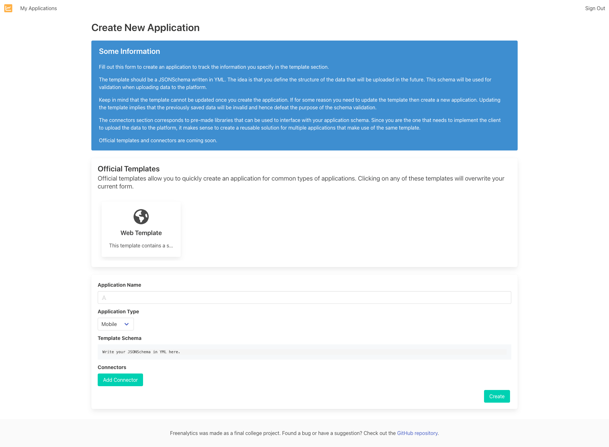
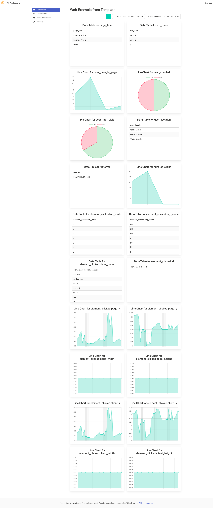
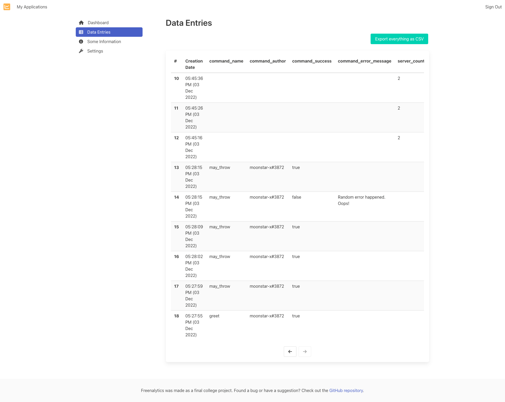
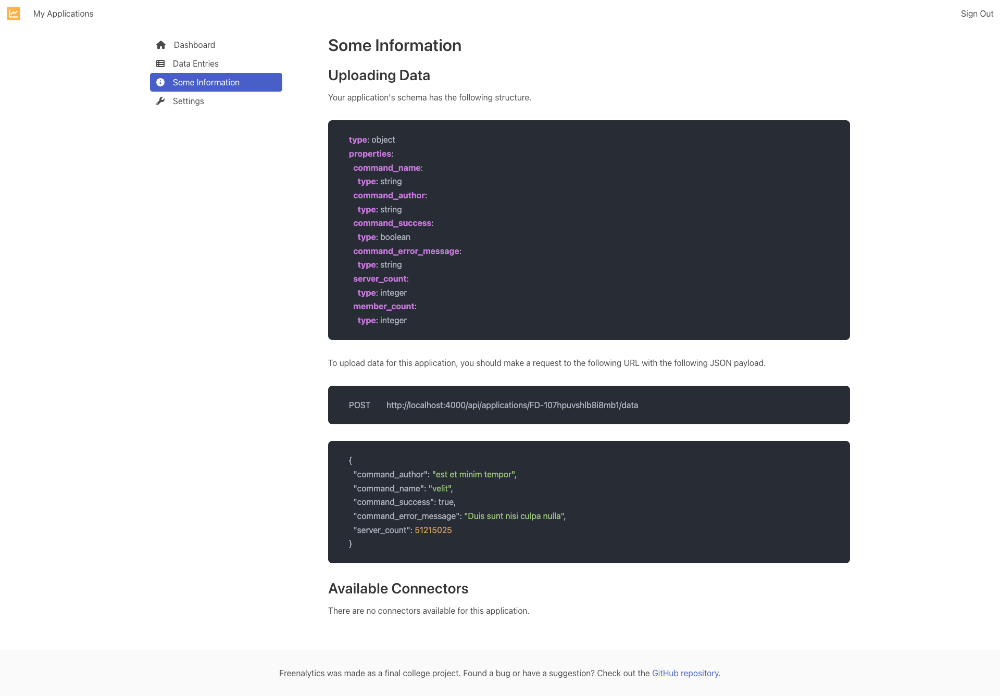

---
hide:
  - navigation
  - toc
---

## What is this?

Freenalytics is an open source usage analytics platform for any type of application. It serves as a tool to empower
small development teams that need a customizable analytics compilation service in their applications that can be self-hosted
easily.

## Why?

This project aims to be a simple yet powerful analytics dashboard for any type of application that can benefit from usage analytics,
from simple websites, to server applications, to maybe even bots for [Discord](https://discord.com).

It is still in an early stage and currently works as a "simple log aggregator" with bare bones visualization tools.

Finally, it was built as a final college project as a requirement to get my Computer Science Engineer degree.

## Got any Screenshots?

In case you're curious to see what this application looks like, take a look at the next screenshots.

<figure markdown>
  
  <figcaption>Applications page</figcaption>
</figure>

<figure markdown>
  
  <figcaption>Create your application</figcaption>
</figure>

<figure markdown>
  
  <figcaption>Web application dashboard</figcaption>
</figure>

<figure markdown>
  
  <figcaption>Discord Bot application dashboard</figcaption>
</figure>

<figure markdown>
  
  <figcaption>Raw data entries</figcaption>
</figure>

<figure markdown>
  
  <figcaption>Information page to guide you on how to upload your data</figcaption>
</figure>

## Interested?

Check out the [Getting Started](http://0.0.0.0:8000/getting-started/) page to start using Freenalytics today.

## Author

This application was made by [moonstar-x](https://github.com/moonstar-x) for [Freenalytics](https://github.com/freenalytics).
